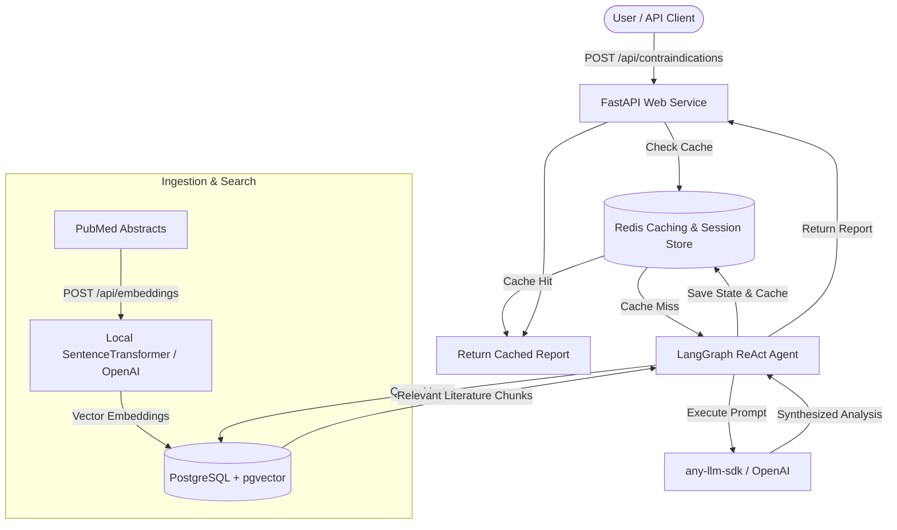

# 🌊 DeepDive: Medical Intervention Contraindication Analysis RAG Agent

DeepDive is a high-performance, asynchronous Retrieval-Augmented Generation (RAG) agent specialized in checking and analyzing contraindications for medical interventions. By combining **FastAPI**, **PostgreSQL (with `pgvector`)**, **Redis**, and **LangGraph**, DeepDive provides an automated pipeline to ingest scientific literature, perform semantic vector search, and run an LLM-powered agent to synthesize clinical contraindication insights.

---

## 🏗️ Architecture & Data Flow



---

## 🚀 Key Features

* **Semantic Literature Search:** Stores PubMed abstract embeddings in PostgreSQL using `pgvector` to run cosine similarity queries.
* **Autonomous ReAct Loop:** Employs a `LangGraph` agent that dynamically searches scientific literature, evaluates conditions, and refines queries.
* **Persistent Session State:** Utilizes `AsyncRedisSaver` as a checkpointer to persist conversation history and agent trajectories.
* **High-Speed Caching:** Caches synthesized contraindication reports in Redis with a configurable TTL (default: 1 hour).
* **Modern Tooling:** Managed with **uv**, linted with **Ruff**, type-checked with **Mypy**, and tested with **Pytest**.
* **Deployment-Ready:** Packed with Docker and Kubernetes deployment manifests.

---

## 🛠️ Tech Stack

* **Core:** Python 3.12+, FastAPI, SQLAlchemy 2.0 (with `asyncpg`)
* **Agent:** LangGraph, any-agent, any-llm-sdk
* **Database & Memory:** PostgreSQL, pgvector, Redis, redis-py
* **Workflow & Quality:** Ruff, Mypy, Pytest

---

## ⚙️ Configuration & Environment

Create a `.env` file in the root directory to customize the agent's behavior:

| Variable | Description | Default |
| :--- | :--- | :--- |
| `PROJECT_NAME` | Name of the FastAPI application | `"DeepDive RAG Agent"` |
| `POSTGRES_USER` | PostgreSQL Username | `"postgres"` |
| `POSTGRES_PASSWORD` | PostgreSQL Password | `"postgres"` |
| `POSTGRES_HOST` | PostgreSQL Hostname | `"localhost"` |
| `POSTGRES_PORT` | PostgreSQL Port | `"5432"` |
| `POSTGRES_DB` | PostgreSQL Database | `"deepdive"` |
| `REDIS_URL` | Redis Connection URI | `"redis://localhost:6379/0"` |
| `LLM_PROVIDER` | Provider for `any-llm-sdk` | `"openai"` |
| `LLM_API_BASE` | Custom base URL for LLM completion API | `"http://localhost:8000/v1"` |
| `LLM_API_KEY` | API key for LLM provider | `"dummy"` |
| `LLM_MODEL` | LLM model version | `"gpt-4o"` |
| `EMBEDDING_BACKEND` | Local embedding or OpenAI endpoint (`local` or `openai`) | `"local"` |
| `EMBEDDING_MODEL` | HuggingFace model name for local embeddings | `"all-MiniLM-L6-v2"` |
| `EMBEDDING_DIMENSION`| Dimensionality of the vector embeddings | `384` |

---

## ⚡ Local Development

### 1. Prerequisites
Ensure you have the following running in your local environment:
* **Python 3.12**
* **PostgreSQL** (configured with the `vector` extension)
* **Redis**

### 2. Install Dependencies
Using **uv**, sync all dependency groups:
```bash
uv sync --all-groups
```

### 3. Run the Development Server
Start the FastAPI server locally:
```bash
uv run uvicorn deepdive.main:app --reload
```
The API documentation will be available at [http://localhost:8000/docs](http://localhost:8000/docs).

### 4. Running Quality Checks
```bash
# Code formatting and linting
uv run ruff check src/

# Static type checking
uv run mypy src/

# Run unit tests
uv run pytest
```

---

## 🔌 API Endpoints

### 🩺 Health Check
* **`GET /health`**
  Returns service status information.

### 📥 Ingest PubMed Abstract
* **`POST /api/embeddings`**
  Generates vector embeddings for a PubMed abstract and persists it.
  * **Request Body:**
    ```json
    {
      "pmid": "37123456",
      "title": "Adverse drug reactions of NSAIDs",
      "abstract": "NSAIDs are associated with an increased risk of gastrointestinal bleeding..."
    }
    ```

### 🔍 Search Indications
* **`GET /api/indications?question=<query>`**
  Performs semantic vector search across all ingested abstracts. Returns the top 10 ranked by cosine similarity.

### 🧠 Analyze Contraindications
* **`POST /api/contraindications`**
  Invokes the RAG agent to analyze and synthesize a clinical report for the given intervention.
  * **Request Body:**
    ```json
    {
      "intervention": "Aspirin"
    }
    ```
  * **Response:**
    ```json
    {
      "intervention": "Aspirin",
      "analysis": "Based on literature retrieval, Aspirin is contraindicated in patients with active gastrointestinal ulceration, severe renal impairment, or late-stage pregnancy..."
    }
    ```

---

## 🤖 CI/CD Workflow
A GitHub Actions workflow is configured in `.github/workflows/ci.yml` that triggers on pull requests and pushes to `main`/`master` to run:
1. **Ruff lint checks**
2. **Mypy type checking**
3. **Pytest test suite**
